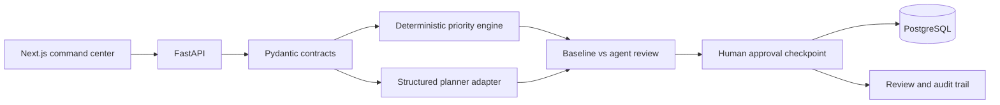

# Personal Command Center Agent

> A private, approval-first planning copilot that turns priorities, constraints, and available time into an explainable day plan.

Personal Command Center is built around a simple rule: **normal code owns decisions that must be predictable**. The configured provider can add interpretation and trade-off language, but it must return typed data, preserve every task, expose conflicts, and wait for a human checkpoint before anything becomes a commitment.

## Product preview

The current web experience includes:

- A focused command-center dashboard with an animated Three.js planning core
- Fast task capture with deadline, duration, energy, and priority inputs
- Server-backed inbox updates with clear API errors
- A visual distinction between available work, planning signals, and schedule review
- Responsive navigation for desktop and smaller screens

Run the web preview with `npm run dev --workspace apps/web`, then open `/capture`.

## Core user experience

### Capture

The capture screen is designed for the moment a task enters the user’s head. The user provides a title, optional deadline, estimated duration, energy requirement, and priority tag. The form validates those values with a shared Zod schema before submitting, then refreshes from the API after create and delete operations.

### Plan

The planning flow begins with a deterministic baseline. Each task is ranked, placed into the available time window, and returned as a typed schedule proposal. A configured OpenAI-compatible provider may produce a second proposal, but every response is validated against the same safety rules and falls back to the baseline on failure.

### Review

The Today view is the human checkpoint. It shows baseline and provider proposals side by side, allows block time edits and reordering, highlights conflicts and fallback status, and requires explicit approval before a plan becomes a durable commitment.

### End-of-day reflection

At the end of the day, each task can be marked completed or carried over with an optional note. Carry-over is explicit rather than automatic. The resulting summary distinguishes finished work from unfinished work and provides an audit-friendly record of the user’s decision.

## Why this project exists

Most autonomous planner demos optimize for impressive output instead of dependable behavior. They silently drop tasks, invent durations, overbook a day, or write to external systems before the user can inspect the decision.

This project treats planning as decision support:

1. Capture the user’s actual inputs.
2. Establish a reproducible baseline with ordinary code.
3. Compare any model proposal against that baseline.
4. Show reasoning, overloads, and deadline conflicts.
5. Require explicit approval before a plan is committed.

## Architecture



### Current implementation boundary

The deterministic engine, validated provider adapter, SQLAlchemy persistence, approval workflow, audit records, complete capture-to-review web flow, API integration tests, interactive Three.js planning scene, and Playwright coverage are implemented. SQLite is the local default; Docker Compose uses PostgreSQL through `DATABASE_URL`. Authentication is currently a single development identity, not a multi-user security boundary.

The dashboard's planning core renders live inbox tasks as priority-colored nodes, supports hover details and selection, honors reduced-motion preferences, adapts particle density for smaller screens, and falls back to an accessible static message when WebGL is unavailable. Timeline blocks support inline start/end editing and reordering before approval.

CI runs backend tests, a frontend production build, and Chromium Playwright coverage. Calendar and email integrations, autonomous external writes, production authentication, and tenant isolation remain intentionally out of scope for this approval-first MVP.

## Repository map

```text
apps/web/                  Next.js dashboard, capture flow, and 3D focus visual
services/api/              FastAPI routes, persistence models, migrations, seed data
packages/core/             Pydantic contracts and deterministic planning engine
packages/agent/            Typed planner response and orchestration boundary
tests/api/                 FastAPI integration tests
tests/evals/               Synthetic scenario fixtures and evaluation assertions
apps/web/e2e/              Playwright capture-to-review flow
infra/                     Local Postgres, API, and web Docker Compose setup
```

## Quick start

### 1. Prepare the environment

```bash
git clone <repository-url>
cd Personal-Command-Center-Agent
cp .env.example .env
```

For local development without Docker, use `DATABASE_URL=sqlite:///./command_center.db` in `.env`.

### 2. Start the local stack

```bash
docker compose -f infra/docker-compose.yml up --build
```

The web app is available at `http://localhost:3000/capture`. The API is available at `http://localhost:8000/docs`; the API root shows service links rather than the web UI.

### 3. Seed synthetic demo tasks

In a second terminal, run:

```bash
python services/api/scripts/seed_demo.py
```

The seed creates 15 realistic but synthetic tasks and does not require private credentials or external services.

### Frontend-only preview

When Docker is unavailable:

```bash
npm install --prefix apps/web
npm run dev --prefix apps/web -- --hostname 0.0.0.0 --port 3000
```

Open `http://localhost:3000/capture`. In a hosted development environment, forward the selected port through the editor’s Ports panel.

Apply database migrations manually when running the API outside Docker:

```bash
alembic -c services/api/alembic.ini upgrade head
```

## Deterministic planning baseline

`packages/core/priority.py` is a pure function: it receives tasks and planning constraints and returns `TaskScheduleProposal` objects without making network calls or mutating storage.

The current scoring model combines three transparent signals:

| Signal | Behavior |
| --- | --- |
| Priority tag | `urgent_important`, `important`, `routine`, and `low` receive descending base weights |
| Deadline urgency | Tasks with deadlines closer to the planning start receive additional weight |
| Energy match | A task matching the requested focus energy receives a bonus; high-energy work in a low-energy window is penalized |

After ranking, the scheduler places tasks sequentially from `available_start`. A 10-minute buffer is inserted between non-conflicting blocks. A task is marked with `conflict_flag=true` when its estimated end exceeds the available budget or its hard deadline. Overloaded tasks retain their original duration and receive the exact reason `Day overloaded: exceeded available time budget`.

This design makes the baseline easy to test, explain, and compare. It also provides a meaningful fallback when a model provider is unavailable or returns invalid structured data.

### Example proposal

```json
{
	"task_id": "8b3d1f91-94e1-4bc8-a43b-bac9a16b7b2f",
	"proposed_start": "2026-10-09T09:00:00Z",
	"proposed_end": "2026-10-09T09:45:00Z",
	"reasoning": "Priority important; energy match: true",
	"conflict_flag": false,
	"user_approved": false
}
```

The baseline does not claim that a score is objectively correct. It makes the trade-off visible, reproducible, and editable by the person who owns the day.

## Shared data contracts

The backend uses Pydantic v2 models and the frontend mirrors the input contract with Zod. The central `Task` model includes:

- Identity and timestamps: UUID, creation time, and update time
- Work description: title and optional description
- Planning inputs: optional deadline, estimated minutes, energy level, and priority tag
- Lifecycle state: inbox, scheduled, completed, or carried over
- Provenance: manual note, web form, or inbox

`TaskScheduleProposal` intentionally keeps planning separate from the task itself. A schedule proposal can be rejected or replaced without rewriting the user’s original task data.

The structured planner response adds a day summary, planned blocks, an optional overload warning, deferred task IDs, and a trade-off rationale. Returning this response as a Pydantic instance prevents raw untyped dictionaries from crossing the agent boundary.

## API surface

| Method | Route | Purpose |
| --- | --- | --- |
| `POST` | `/api/tasks` | Add a typed task to the inbox |
| `GET` | `/api/tasks` | List captured tasks |
| `GET/PATCH/DELETE` | `/api/tasks/{task_id}` | Read, edit, or delete a task |
| `POST` | `/api/plans/generate` | Compare deterministic and provider plans |
| `GET` | `/api/plans` and `/api/plans/{plan_id}` | List or retrieve plans |
| `PATCH` | `/api/plans/{plan_id}/blocks` | Save reviewed block edits |
| `POST` | `/api/plans/{plan_id}/approve` | Explicitly approve a plan |
| `POST` | `/api/plans/{plan_id}/reject` | Reject a plan |
| `POST` | `/api/plans/{plan_id}/review` | Record completion or carry-over decisions |
| `GET` | `/api/plans/{plan_id}/audit` | Read the audit history |
| `GET` | `/health` and `/ready` | Liveness and database readiness |
| `GET` | `/api/info` | API metadata and web route hint |

All plan proposals use Pydantic models. The review route only changes task status from an explicit user payload; it does not reschedule work autonomously.

### Generate a plan

```bash
curl -X POST http://localhost:8000/api/plans/generate \
	-H 'Content-Type: application/json' \
	-d '{
		"date": "2026-10-09",
		"available_hours": 6,
		"energy_level": "medium",
		"task_ids": []
	}'
```

The response is intentionally side by side:

```json
{
	"baseline": [],
	"proposal": {
		"day_summary": "Proposed 0 of 0 tasks with explicit conflicts.",
		"planned_blocks": [],
		"overload_warning": null,
		"deferred_tasks": [],
		"trade_off_rationale": "The structured planner preserves every task and exposes baseline conflicts for human review."
	}
}
```

Provider timeouts, authentication failures, retry exhaustion, malformed JSON, or unsafe plans fall back to the deterministic proposal with a non-secret `fallback_reason`. Every provider response is checked for task accounting, estimates, deadlines, overlaps, planning-window bounds, reasoning, and unsupported action claims.

### Submit an end-of-day review

```bash
curl -X POST http://localhost:8000/api/plans/{plan_id}/review \
	-H 'Content-Type: application/json' \
	-d '[
		{"task_id": "8b3d1f91-94e1-4bc8-a43b-bac9a16b7b2f", "completed": true},
		{"task_id": "6e5f0c6a-1f18-47ab-9c6d-8f0d5e1f3a12", "completed": false, "notes": "Waiting for review input"}
	]'
```

The review endpoint requires an approved plan, updates task status to `completed` or `carried_over`, persists notes, records an audit event, and moves the plan to `COMPLETED`. It does not silently create a new schedule.

## Privacy and safety boundary

- Stored data: task titles, descriptions, deadlines, estimates, energy, status, review notes, and audit records
- Provider boundary: the configured adapter receives only the context needed for a requested plan and the deterministic baseline
- Structured output: provider responses must validate against `DailyPlanResponse`
- Identity boundary: the default `development-user` scope can be overridden with `X-User-ID`; this is a development boundary, not production authentication
- Human control: calendar, email, social, and other external write actions are not implemented
- Demo data: seed records are synthetic and contain no personal information

The model is an interpreter and drafting assistant. Permissions, validation, scheduling arithmetic, storage, and irreversible actions belong to normal application code.

## Quality checks

```bash
pytest

# Run browser coverage (install Chromium once)
npm install --prefix apps/web
npx --prefix apps/web playwright install chromium
npm run test:e2e --prefix apps/web
```

Fixtures cover overloaded days, conflicting deadlines, default estimates, low-energy windows, and balanced schedules. Core assertions check that every input task remains represented and that every proposal contains reasoning.

### Evaluation principles

The planning evaluator is deliberately behavioral rather than stylistic. A plan is not considered reliable merely because its prose sounds confident. The important assertions are:

1. **No lost tasks:** scheduled, deferred, and explicitly conflicted tasks must account for every input task.
2. **Deadline honesty:** a block must not pass a hard deadline without an explicit conflict flag.
3. **Reason transparency:** every proposal must include a non-empty reason that can be shown to the user.
4. **Estimate integrity:** the planner must not shorten an estimate to make an overloaded day appear feasible.
5. **Human checkpoint:** no review flow should change a commitment without an explicit user payload.

### Useful development commands

```bash
# Install frontend dependencies
npm install --prefix apps/web

# Run the web app on a hosted-friendly interface
npm run dev --prefix apps/web -- --hostname 0.0.0.0 --port 3000

# Run the Python test suite
pytest

# Inspect API documentation while the service is running
open http://localhost:8000/docs
```

The repository uses separate JavaScript and Python dependency manifests. The web package declares Next.js, React, Zod, Three.js, and Playwright. The Python package declares FastAPI, Uvicorn, Pydantic, SQLAlchemy, Alembic, PostgreSQL, and development test dependencies.

## Provider configuration

The provider factory reads `LLM_PROVIDER`, `LLM_API_KEY`, `LLM_MODEL`, `LLM_BASE_URL`, `LLM_TIMEOUT_SECONDS`, and `LLM_MAX_RETRIES`. Use `LLM_PROVIDER=deterministic` for offline operation. Use `LLM_PROVIDER=openai-compatible` with a compatible base URL, model, and key for structured JSON proposals. Secrets are not logged.

## Approval workflow

Plans move through `GENERATED`, `EDITED`, `APPROVED`, `REJECTED`, and `COMPLETED` states. Generation persists both the deterministic baseline and provider proposal. Edits create audit records, approval is explicit and idempotent, and reviews update task status only after the review payload is submitted. Calendar, email, social, scraping, browser automation, and autonomous external writes are not implemented.

## Roadmap

- [x] Monorepo blueprint and shared contracts
- [x] Deterministic priority and scheduling baseline
- [x] Responsive task capture experience
- [x] Structured planner response boundary
- [x] Synthetic evaluation fixtures
- [x] Connect SQLAlchemy repositories to the API routes
- [x] Add an OpenAI-compatible adapter with strict JSON validation
- [x] Complete approval persistence and audit records
- [x] Add editable timeline blocks and Playwright capture-to-review flow
- [x] Add API integration and trace-backed browser evaluation coverage
- [ ] Add calendar and email integrations after permission and audit UX is mature

## Known limitations

The development identity is single-user only; production authentication and tenant isolation remain future work. `X-User-ID` can select a development scope, but it is not authentication. The Today UI supports task selection, generation, side-by-side comparison, block time editing, reordering, approval, rejection, and end-of-day completion/carry-over review. Missing duration estimates use the documented 30-minute default, while deadline conflicts and day overloads are surfaced rather than hidden.

This project is not an autonomous calendar assistant. It does not send email, edit calendars, scrape websites, or make external write actions. Those integrations should only be added after permission scopes, review states, failure handling, and audit records are complete.

## License

This project is licensed under the MIT License. See [LICENSE](./LICENSE).