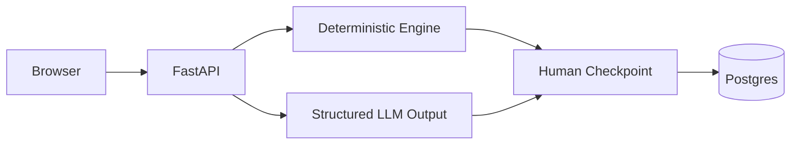

# Personal Command Center Agent

An approval-first daily planner that turns personal priorities into an explainable schedule without silently changing commitments.

## Architecture

## Private-by-design boundary

Tasks, deadlines, estimates, review notes, and audit records are stored locally. A future provider adapter receives only the task context needed for a requested plan and must return validated structured output. No calendar, email, or other write action happens without an explicit approval payload.

## Quick start

1. Clone this repository and copy `.env.example` to `.env`.
2. Run `docker compose -f infra/docker-compose.yml up --build`.
3. Run `python services/api/scripts/seed_demo.py` from the repository root.

## Layout

`apps/web` contains the Next.js interface. `services/api` contains FastAPI routes, persistence models, migrations, and seed data. `packages/core` owns Pydantic contracts and the deterministic baseline. `packages/agent` owns provider-neutral structured orchestration. `tests/evals` contains synthetic scenario fixtures.

## Known limitations

The current local API uses an in-memory task store until database wiring is enabled. The deterministic baseline uses explicit estimates and flags overloads rather than truncating tasks. Missing estimates default to 30 minutes, deadline conflicts are surfaced, and the structured planner is a provider-neutral fallback until credentials and an SDK adapter are configured.